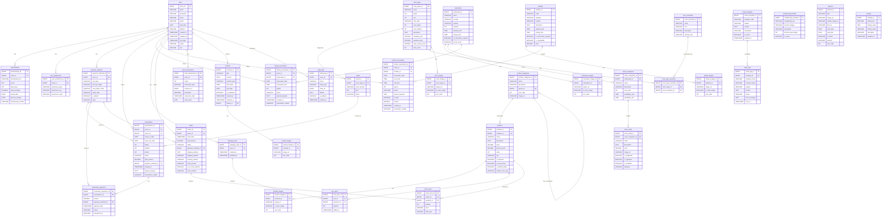

```mermaid
erDiagram
    %% 사용자 관련 테이블 관계
    users ||--o{ memberships : "has"
    users ||--o{ user_preferences : "has"
    users ||--o{ payment_methods : "has"
    users ||--o{ reservations : "makes"
    users ||--o{ dining_reservations : "makes"
    users ||--o{ facility_reservations : "makes"
    users ||--o{ shopping_carts : "has"
    users ||--o{ orders : "places"
    users ||--o{ point_transactions : "has"
    users ||--o{ contents : "authors"
    users ||--o{ audit_logs : "generates"

    %% 객실 관련 테이블 관계
    room_types ||--o{ rooms : "categorizes"
    room_types ||--o{ room_type_amenities : "has"
    room_types ||--o{ room_images : "has"
    room_amenities ||--o{ room_type_amenities : "associated_with"
    rooms ||--o{ reservations : "booked_as"

    %% 예약 관련 테이블 관계
    reservations ||--o{ reservation_payments : "has"
    payment_methods ||--o{ reservations : "used_for"
    payment_methods ||--o{ reservation_payments : "used_for"
    payment_methods ||--o{ orders : "used_for"

    %% 다이닝 관련 테이블 관계
    restaurants ||--o{ restaurant_images : "has"
    restaurants ||--o{ menu_categories : "offers"
    restaurants ||--o{ dining_reservations : "accepts"
    menu_categories ||--o{ menu_items : "contains"

    %% 기프트샵 관련 테이블 관계
    product_categories ||--o{ products : "categorizes"
    product_categories ||--o{ product_categories : "has_subcategory"
    products ||--o{ product_images : "has"
    products ||--o{ cart_items : "added_to"
    products ||--o{ order_items : "ordered_as"
    shopping_carts ||--o{ cart_items : "contains"
    orders ||--o{ order_items : "contains"

    %% 부대시설 관련 테이블 관계
    facilities ||--o{ facility_images : "has"
    facilities ||--o{ facility_reservations : "accepts"

    %% 컨텐츠 관리 테이블 관계
    contents ||--o{ content_images : "has"

    %% 시스템 관리 테이블 관계
    email_templates ||--o{ email_logs : "generates"

    %% 테이블 정의
    users {
        BIGINT users_id PK
        VARCHAR email
        VARCHAR password
        VARCHAR name
        VARCHAR phone
        DATE birth_date
        VARCHAR address
        TIMESTAMP created_at
        TIMESTAMP updated_at
        TIMESTAMP last_login
        VARCHAR status
        VARCHAR role
    }

    memberships {
        BIGINT memberships_id PK
        BIGINT users_id FK
        VARCHAR membership_tier
        INT points
        INT total_stays
        DECIMAL total_spending
        DATE joined_date
        DATE last_tier_change
        VARCHAR membership_number
    }

    user_preferences {
        BIGINT user_preferences_id PK
        BIGINT users_id FK
        VARCHAR preference_type
        VARCHAR preference_key
        VARCHAR preference_value
    }

    payment_methods {
        BIGINT payment_methods_id PK
        BIGINT users_id FK
        VARCHAR card_type
        VARCHAR last_four_digits
        VARCHAR card_holder_name
        VARCHAR expiry_date
        BOOLEAN is_default
        VARCHAR token
    }

    room_types {
        BIGINT room_types_id PK
        VARCHAR name
        INT grade
        INT size
        VARCHAR view_type
        INT max_adults
        INT max_children
        TEXT description
        DECIMAL weekday_price
        DECIMAL weekend_price
        DECIMAL peak_season_price
        INT total_rooms
    }

    rooms {
        BIGINT rooms_id PK
        BIGINT room_types_id FK
        VARCHAR room_number
        INT floor
        VARCHAR status
    }

    room_amenities {
        BIGINT room_amenities_id PK
        VARCHAR name
        VARCHAR icon
        VARCHAR description
        VARCHAR amenity_type
    }

    room_type_amenities {
        BIGINT room_type_amenities_id PK
        BIGINT room_types_id FK
        BIGINT room_amenities_id FK
    }

    room_images {
        BIGINT room_images_id PK
        BIGINT room_types_id FK
        VARCHAR image_url
        BOOLEAN is_main_image
        INT sort_order
    }

    reservations {
        BIGINT reservations_id PK
        BIGINT users_id FK
        BIGINT rooms_id FK
        DATE check_in_date
        DATE check_out_date
        INT adults
        INT children
        INT infants
        VARCHAR status
        DECIMAL total_amount
        BIGINT payment_methods_id FK
        TIMESTAMP created_at
        TEXT special_requests
        VARCHAR reservation_number
    }

    reservation_payments {
        BIGINT reservation_payments_id PK
        BIGINT reservations_id FK
        DECIMAL amount
        BIGINT payment_methods_id FK
        TIMESTAMP payment_date
        VARCHAR status
        VARCHAR transaction_id
    }

    restaurants {
        BIGINT restaurants_id PK
        VARCHAR name
        VARCHAR concept
        VARCHAR location
        INT capacity
        TIME opening_time
        TIME closing_time
        BOOLEAN is_reservation_required
        VARCHAR access_level
    }

    restaurant_images {
        BIGINT restaurant_images_id PK
        BIGINT restaurants_id FK
        VARCHAR image_url
        BOOLEAN is_main_image
        INT sort_order
    }

    menu_categories {
        BIGINT menu_categories_id PK
        BIGINT restaurants_id FK
        VARCHAR name
        VARCHAR description
        INT sort_order
        TIME availability_start
        TIME availability_end
    }

    menu_items {
        BIGINT menu_items_id PK
        BIGINT menu_categories_id FK
        VARCHAR name
        TEXT description
        DECIMAL price
        VARCHAR image_url
        BOOLEAN is_vegetarian
        BOOLEAN is_signature
        BOOLEAN is_available
        VARCHAR allergens
    }

    dining_reservations {
        BIGINT dining_reservations_id PK
        BIGINT users_id FK
        BIGINT restaurants_id FK
        DATE reservation_date
        TIME reservation_time
        INT guests
        VARCHAR status
        TEXT special_requests
        TIMESTAMP created_at
        VARCHAR reservation_number
    }

    product_categories {
        BIGINT product_categories_id PK
        VARCHAR name
        VARCHAR description
        BIGINT parent_id FK
        INT sort_order
        VARCHAR image_url
    }

    products {
        BIGINT products_id PK
        BIGINT category_id FK
        VARCHAR name
        TEXT description
        DECIMAL price
        DECIMAL discount_price
        INT stock
        VARCHAR sku
        BOOLEAN is_featured
        BOOLEAN is_new_arrival
        BOOLEAN is_limited_edition
        VARCHAR related_room_type
    }

    product_images {
        BIGINT product_images_id PK
        BIGINT products_id FK
        VARCHAR image_url
        BOOLEAN is_main_image
        INT sort_order
    }

    shopping_carts {
        BIGINT shopping_carts_id PK
        BIGINT users_id FK
        TIMESTAMP created_at
        TIMESTAMP updated_at
    }

    cart_items {
        BIGINT cart_items_id PK
        BIGINT cart_id FK
        BIGINT products_id FK
        INT quantity
        TIMESTAMP added_at
    }

    orders {
        BIGINT orders_id PK
        BIGINT users_id FK
        TIMESTAMP order_date
        DECIMAL total_amount
        VARCHAR status
        BIGINT payment_methods_id FK
        TEXT shipping_address
        VARCHAR shipping_method
        VARCHAR tracking_number
        VARCHAR order_number
        BOOLEAN is_in_room_delivery
        VARCHAR room_number
    }

    order_items {
        BIGINT order_items_id PK
        BIGINT orders_id FK
        BIGINT products_id FK
        INT quantity
        DECIMAL price
        DECIMAL total_price
    }

    facilities {
        BIGINT facilities_id PK
        VARCHAR name
        VARCHAR category
        VARCHAR location
        TEXT description
        TIME opening_time
        TIME closing_time
        BOOLEAN is_reservation_required
        BOOLEAN is_chargeable
        DECIMAL price
    }

    facility_images {
        BIGINT facility_images_id PK
        BIGINT facilities_id FK
        VARCHAR image_url
        BOOLEAN is_main_image
        INT sort_order
    }

    facility_reservations {
        BIGINT facility_reservations_id PK
        BIGINT users_id FK
        BIGINT facilities_id FK
        DATE reservation_date
        TIME start_time
        TIME end_time
        INT guests
        VARCHAR status
        TEXT special_requests
        BOOLEAN is_paid
        DECIMAL amount
        TIMESTAMP created_at
        VARCHAR reservation_number
    }

    point_transactions {
        BIGINT point_transactions_id PK
        BIGINT users_id FK
        INT points
        VARCHAR transaction_type
        BIGINT reference_id
        VARCHAR description
        TIMESTAMP transaction_date
        DATE expiry_date
    }

    membership_benefits {
        BIGINT membership_benefits_id PK
        VARCHAR membership_tier
        VARCHAR benefit_category
        VARCHAR description
        INT discount_percentage
        BOOLEAN is_active
    }

    contents {
        BIGINT contents_id PK
        VARCHAR title
        TEXT content
        VARCHAR content_type
        DATE start_date
        DATE end_date
        BOOLEAN is_published
        TIMESTAMP created_at
        TIMESTAMP updated_at
        BIGINT author_id FK
    }

    content_images {
        BIGINT content_images_id PK
        BIGINT contents_id FK
        VARCHAR image_url
        INT sort_order
    }

    banners {
        BIGINT banners_id PK
        VARCHAR title
        VARCHAR image_url
        VARCHAR mobile_image_url
        VARCHAR link_url
        DATE start_date
        DATE end_date
        BOOLEAN is_active
        VARCHAR position
        INT sort_order
    }

    settings {
        BIGINT settings_id PK
        VARCHAR setting_key
        TEXT setting_value
        VARCHAR setting_group
        VARCHAR description
        TIMESTAMP updated_at
    }

    audit_logs {
        BIGINT audit_logs_id PK
        BIGINT users_id FK
        VARCHAR action
        VARCHAR entity_type
        BIGINT entity_id
        TEXT details
        VARCHAR ip_address
        TIMESTAMP created_at
    }

    email_templates {
        BIGINT email_templates_id PK
        VARCHAR template_code
        VARCHAR subject
        TEXT content
        VARCHAR description
        BOOLEAN is_active
        TIMESTAMP updated_at
    }

    email_logs {
        BIGINT email_logs_id PK
        BIGINT template_id FK
        VARCHAR recipient_email
        VARCHAR recipient_name
        VARCHAR subject
        TEXT content
        VARCHAR status
        TEXT error_message
        TIMESTAMP sent_at
    }
```
